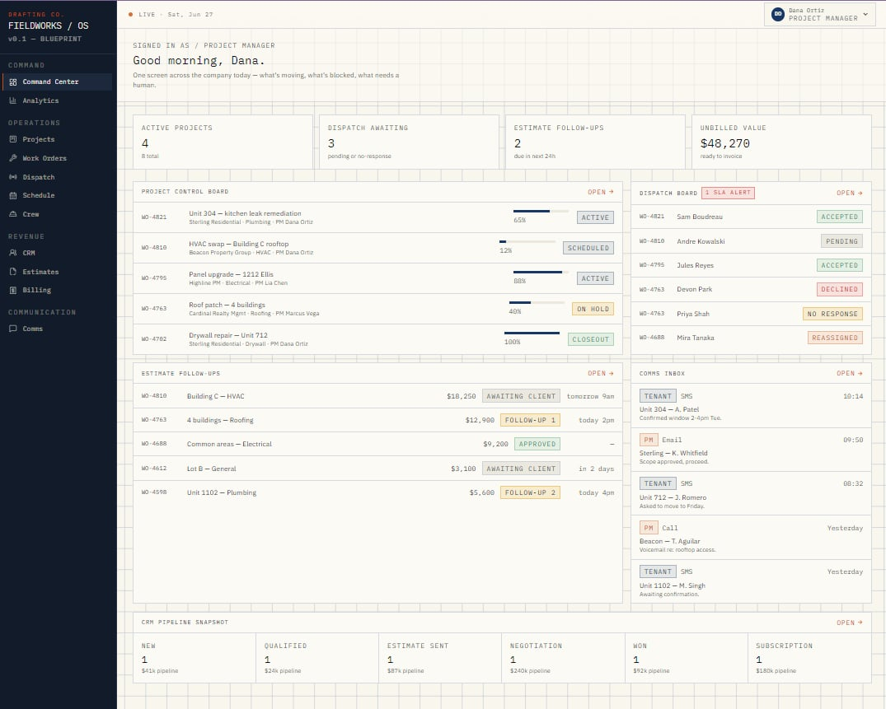
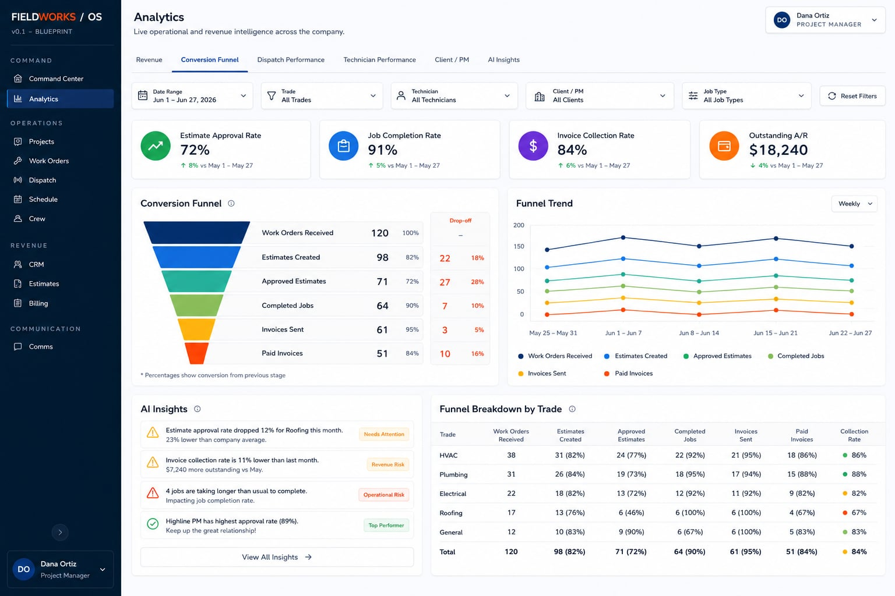
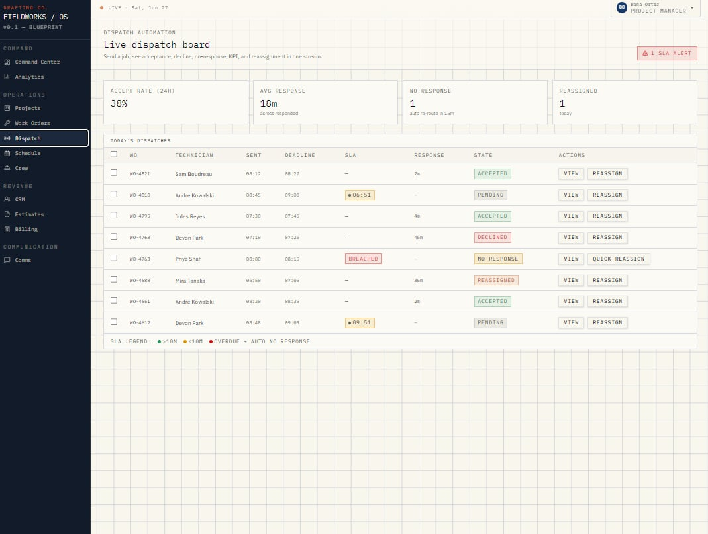
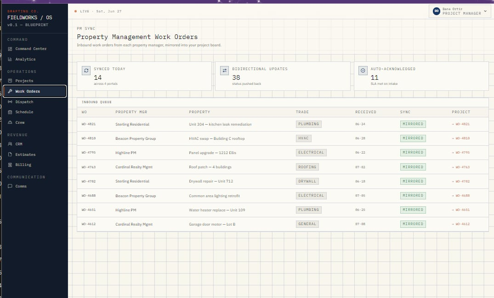
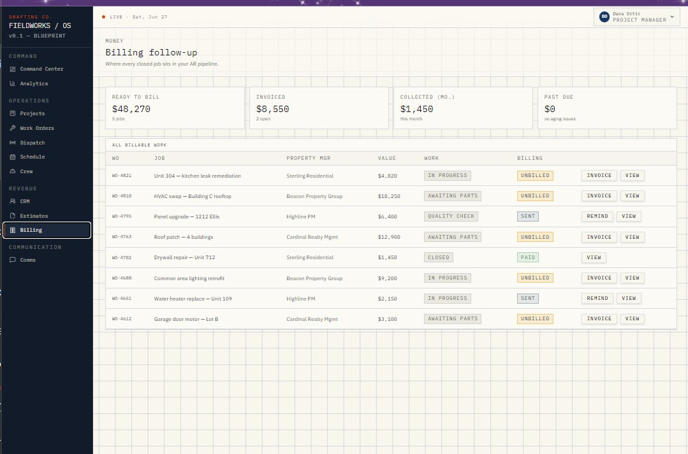

# FIELDWORKS / OS
### All-in-One Construction Operations System
### A JM Brandify Product

FIELDWORKS / OS is an AI-powered operations intelligence platform built for contractors, property managers, and service companies struggling with fragmented workflows, delayed dispatching, missed estimates, and revenue leakage.

It centralizes operations from lead intake to final payment in one system.

It unifies:

* CRM Pipeline
* Project Management
* Property Management Work Orders
* Dispatch Automation
* Scheduling
* Crew Performance
* Estimates & Approvals
* Billing & Collections
* Revenue Analytics
* AI Operational Insights

Built to eliminate operational bottlenecks, improve visibility, and maximize profitability.

## Product Preview

### Command Center

Real-time operational overview of projects, dispatch status, estimates, and communication.

### Analytics Dashboard

Track revenue, conversion funnel, approval rates, collections, and AI insights.

### Dispatch Automation

Monitor technician response, SLA breaches, reassignment, and live dispatch KPIs.

### Work Order Management

Sync property management work orders and centralize job progress.

### Billing & Collections

Track invoices, outstanding receivables, and payment follow-ups.

## Business Impact

✔ Reduce dispatch delays and missed assignments  
✔ Increase estimate approval conversion  
✔ Improve technician accountability  
✔ Track unpaid invoices and cash flow  
✔ Prevent revenue leakage  
✔ Centralize communication across PMs, tenants, and crews  

## Built With
- HTML
- CSS
- JavaScript
- Lovable (UI prototyping)
- GitHub
- Planned backend: Supabase / PostgreSQL
- Planned integrations: AppFolio, Property Meld, Housecall Pro, Zapier
  
## Private Demo Access

FIELDWORKS / OS is currently in active prototype development under **JM Brandify**.

To protect proprietary workflow architecture, automation logic, and operational intelligence systems, the full interactive demo is not publicly accessible.

#### Availability

Private live walkthroughs are available for:

* Construction company owners
* Property management vendors
* Operations managers
* Strategic partners / investors

**Interactive demo available upon discovery call.**

If you want to explore how FIELDWORKS / OS can improve dispatching, estimates, work order management, and revenue visibility for your business, feel free to connect.

## Files

- `index.html` - app structure and dashboard sections
- `styles.css` - responsive styling and UI layout
- `app.js` - sample data, filters, automation flows, and view switching

## Status

This is a static prototype. It does not require a backend or build step.

---
Built and designed by **JM Brandify**  
Automate the Noise. Lead the Mission.
